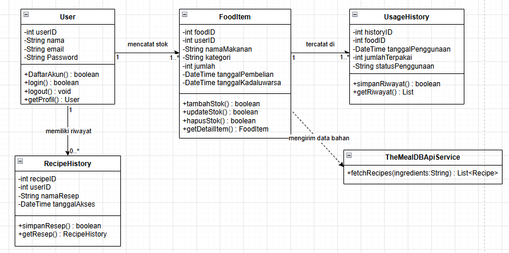

# FOODSAVE

FoodSave merupakan aplikasi desktop berbasis **C#** dengan teknologi **Windows Presentation Foundation (WPF)** yang membantu pengguna mengelola stok bahan makanan, memantau masa kedaluwarsa, dan memperoleh rekomendasi resep berdasarkan bahan yang tersedia. Aplikasi ini menggunakan **PostgreSQL** sebagai basis data utama.

FoodSave dikembangkan untuk membantu mengurangi **food waste (limbah makanan)** di lingkungan rumah tangga dan mahasiswa kos. Dengan pengelolaan stok yang lebih terstruktur, pengguna dapat memanfaatkan bahan makanan secara optimal sebelum rusak atau kedaluwarsa, sekaligus mendukung upaya **Climate Action** melalui pengurangan limbah makanan.

## Kelompok FoodSave

**Ketua Kelompok** :
 **Javier Yazid Janadi (24/545752/TK/60737)** – Software Architect

**Anggota 1**   :
 **Muhammad Khoirunas (24/533373/TK/59083)** – Backend Developer

**Anggota 2**   :
 **Faiz Gymnastiar Wibawa (24/537851/TK/59634)** – Frontend Developer

## Tema

### Climate Action

## Deskripsi Singkat

FoodSave membantu pengguna mengurangi pemborosan makanan dengan menyediakan sistem pencatatan dan pengelolaan stok bahan makanan. Pengguna dapat menyimpan informasi mengenai makanan yang dimiliki, jumlah stok, tanggal pembelian, dan tanggal kedaluwarsa.

Aplikasi juga memberikan **pengingat makanan yang mendekati masa kedaluwarsa** serta menyediakan **rekomendasi resep berdasarkan bahan makanan yang tersedia**. Dengan fitur tersebut, pengguna dapat memanfaatkan bahan makanan secara lebih optimal sebelum rusak atau terbuang.

FoodSave juga menyediakan riwayat penggunaan bahan makanan serta statistik makanan yang digunakan dan terbuang untuk membantu pengguna memantau pola konsumsi dan pemborosan makanan.

## Fitur Aplikasi

### MVP (Minimum Viable Product)

Fitur yang menjadi target pengembangan awal FoodSave meliputi:

* Registrasi dan login pengguna.
* Pencatatan stok bahan makanan.
* Tambah, ubah, hapus, dan lihat data makanan (CRUD).
* Penyimpanan tanggal pembelian dan tanggal kedaluwarsa.
* Notifikasi atau pengingat makanan yang mendekati masa kedaluwarsa.
* Rekomendasi resep berdasarkan bahan makanan yang tersedia.
* Penyimpanan data menggunakan PostgreSQL.

### Fitur Utama

* **Dashboard** — Menampilkan ringkasan stok makanan.
* **Manajemen Stok** — Mengelola data bahan makanan yang dimiliki pengguna.
* **Pengingat Kedaluwarsa** — Memberikan informasi mengenai makanan yang mendekati masa kedaluwarsa.
* **Kategori Makanan** — Mengelompokkan makanan berdasarkan kategorinya.
* **Rekomendasi Resep** — Memberikan rekomendasi resep berdasarkan bahan makanan yang tersedia.
* **Riwayat Penggunaan** — Mencatat penggunaan bahan makanan.
* **Statistik** — Menampilkan jumlah makanan yang digunakan dan makanan yang terbuang.
* **Pencarian dan Penyaringan** — Memudahkan pengguna menemukan data makanan tertentu.

## Teknologi yang Digunakan

| Teknologi         | Kegunaan                                                      |
| ----------------- | ------------------------------------------------------------- |
| **C#**            | Bahasa pemrograman utama aplikasi                             |
| **WPF**           | Framework untuk membangun antarmuka desktop                   |
| **PostgreSQL**    | Sistem manajemen basis data                                   |
| **TheMealDB API** | Menyediakan rekomendasi resep berdasarkan bahan yang tersedia |

FoodSave menggunakan **TheMealDB API** sebagai layanan web pihak ketiga untuk menyediakan rekomendasi resep sehingga bahan makanan yang tersedia dapat dimanfaatkan secara lebih optimal.

## Basis Data

FoodSave menggunakan PostgreSQL untuk menyimpan data aplikasi. Basis data terdiri dari beberapa tabel utama:

### User

Menyimpan informasi pengguna aplikasi.

* `UserID`
* `Nama`
* `Email`
* `Password`

### FoodItem

Menyimpan informasi bahan makanan yang dimiliki pengguna.

* `FoodID`
* `UserID`
* `NamaMakanan`
* `Kategori`
* `Jumlah`
* `TanggalPembelian`
* `TanggalKedaluwarsa`

### UsageHistory

Menyimpan riwayat penggunaan bahan makanan.

* `HistoryID`
* `FoodID`
* `TanggalPenggunaan`
* `JumlahTerpakai`
* `StatusPenggunaan`

### RecipeHistory

Menyimpan riwayat akses terhadap rekomendasi resep.

* `RecipeID`
* `NamaResep`
* `TanggalAkses`
* `UserID`

Struktur tabel tersebut mengikuti rancangan basis data yang telah ditentukan pada tahap brainstorming aplikasi.

## Class Diagram

Class Diagram digunakan untuk menggambarkan struktur kelas serta hubungan antarobjek dalam aplikasi FoodSave.

## Pengembangan Lanjutan

Apabila waktu pengembangan memungkinkan, FoodSave dapat dikembangkan dengan beberapa fitur tambahan, antara lain:

* Pemindaian barcode produk untuk memasukkan data makanan secara otomatis.
* Perhitungan estimasi emisi karbon yang berhasil dikurangi karena berkurangnya food waste.
* Sistem target bulanan untuk mengurangi limbah makanan.
* Ekspor laporan ke dalam format PDF.
* Notifikasi melalui email.
* Grafik tren penggunaan dan pemborosan makanan.
* Sistem rekomendasi resep makanan khas Indonesia berdasarkan bahan yang tersedia.

## Aplikasi Sejenis

FoodSave memiliki konsep yang serupa dengan beberapa aplikasi manajemen makanan seperti **NoWaste, KitchenPal, dan Fridgely**, yang menyediakan fitur pengelolaan inventaris makanan dan pengingat masa kedaluwarsa.

Namun, FoodSave memiliki fokus yang lebih spesifik pada kebutuhan masyarakat Indonesia, khususnya **mahasiswa kos dan rumah tangga**, dengan menggabungkan manajemen stok, pengingat kedaluwarsa, serta rekomendasi resep berdasarkan bahan makanan yang tersedia.

## Tujuan

FoodSave dikembangkan dengan tujuan untuk:

1. Membantu pengguna mengelola persediaan makanan secara lebih terstruktur.
2. Mengurangi risiko makanan terlupakan atau melewati masa kedaluwarsa.
3. Membantu pengguna memanfaatkan bahan makanan yang tersedia melalui rekomendasi resep.
4. Mengurangi pemborosan makanan dan pengeluaran akibat makanan yang terbuang.
5. Mendukung **Climate Action** melalui pengurangan food waste.
